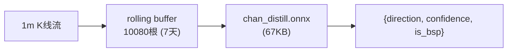

# Chan-Distill：缠论蒸馏模型

将缠论（Chan Theory）蒸馏进时序金字塔 CNN，输入 1m K 线、输出交易信号。**推理时一个 ONNX 文件搞定，零外部依赖。**

## 定位

```
上游项目: chan-xgb（同目录上级项目）
          └── 缠论 + XGBoost → 信号评分，AUC 0.94
              依赖 chan.py 侧车算特征

本项目: chan-distill
          └── 时序金字塔 CNN → 端到端信号，AUPRC 0.086（当前）
              推理时零依赖，一个 ONNX 文件
```

## 架构



模型内部：7 级时序金字塔（Conv1d + stride 降采样）

```
输入 10080 根 1m K 线 (7天)
  │ stride=5   → 5m 分辨率 (2016 位置)
  │ stride=3   → 15m 分辨率 (672 位置)
  │ stride=2   → 30m 分辨率 (336 位置)
  │ stride=2   → 1h 分辨率 (168 位置)
  │ stride=4   → 4h 分辨率 (42 位置)
  │ stride=6   → 1d 分辨率 (7 位置)
  │ stride=7   → 1w 分辨率 (1 位置)
  │ GAP → 128 维向量
  │
  ├── 7 个输出头（涨跌 + Level-1 分型/笔 + BSP）
  └── 4 个输出头（Level-2 区间套分型/笔）
```

## 快速开始

### 1. 拉取数据

```bash
# Go 版本（需要安装 Go）
go run scripts/fetch_1m.go

# 或 Python 版本（需要 ccxt）
python scripts/fetch_1m.py
```

产出：`data/processed/{BTC,ETH,BNB,SOL,XRP}USDT_1m.csv`

### 2. 生成标注数据

```bash
python scripts/generate_labels.py \
  --symbols BTCUSDT ETHUSDT BNBUSDT SOLUSDT XRPUSDT \
  --timeframes 1m \
  --seq-len 10080 --stride 1008
```

产出：`data/labels/*_1m.parquet`

### 3. 训练

```bash
python train.py --seq-len 10080 --d-model 128 --batch-size 8 --epochs 20
```

产出：`checkpoints/best.pt`

### 4. 导出 ONNX

```bash
python export_onnx.py \
  --checkpoint checkpoints/best.pt \
  --output chan_distill.onnx \
  --seq-len 10080 --d-model 128 --in-channels 5
```

产出：`chan_distill.onnx`（67KB）

### 5. 推理

```python
# Python
from infer import ChanDistillInference

engine = ChanDistillInference("chan_distill.onnx", seq_len=10080)
for ohlcv in kline_stream():
    signal = engine.update(ohlcv)  # 内部自动滚动 buffer
    if signal:
        print(f"{signal['direction']} 置信度 {signal['confidence']}")
```

```go
// Go (examples/go/inference/main.go)
engine := NewEngine("chan_distill.onnx")
for kline := range klineStream {
    signal := engine.Update(kline)
    if signal != nil {
        fmt.Printf("%s %s confidence=%.4f\n", kline.Timestamp, signal.Direction, signal.Confidence)
    }
}
```

## 项目结构

```
├── scripts/
│   ├── generate_labels.py    # 缠论标注管线
│   └── fetch_1m.go           # 币安 1m 数据拉取
├── model/
│   └── chandistill.py        # 时序金字塔 CNN + 11 输出头
├── train.py                  # 多任务训练
├── infer.py                  # Python 推理
├── export_onnx.py            # ONNX 导出
├── examples/go/inference/    # Go 推理示例
├── docs/
│   └── architecture.md       # 架构图
├── data/
│   ├── processed/            # 1m K 线 CSV（gitignored）
│   └── labels/               # 标注 parquet（gitignored）
├── checkpoints/              # 模型权重（gitignored）
└── requirements.txt
```

## 模型输出

| 输出头 | 维度 | 含义 |
|--------|------|------|
| `return_logits` | 3 | 未来涨跌（跌/平/涨）|
| `top_fractal` | 1 | Level-1 顶分型 |
| `bottom_fractal` | 1 | Level-1 底分型 |
| `bi_direction_logits` | 3 | 笔方向 |
| `bi_strength` | 1 | 笔强度（回归）|
| `is_bsp` | 1 | 买卖点检测 |
| `bsp_direction_logits` | 3 | BSP 方向 |
| `top_fractal_L2` | 1 | Level-2 顶分型（区间套）|
| `bottom_fractal_L2` | 1 | Level-2 底分型 |
| `bi_direction_logits_L2` | 3 | Level-2 笔方向 |
| `bi_strength_L2` | 1 | Level-2 笔强度 |

最终信号：`buy_score = is_bsp × softmax(bsp_dir)[买]`，取最大值方向 + 置信度。

## 与 chan-xgb 的关系

| 维度 | chan-xgb | chan-distill |
|------|----------|-------------|
| 模型 | XGBoost + 7 模型 Ensemble | 金字塔 CNN × 1 |
| 推理依赖 | chan.py 侧车 | ONNX Runtime 就够了 |
| 输入 | 61 维人工特征 | 原始 1m OHLCV |
| 数据 | ~8000 BSP 样本 | ~9000 样本（5 币种） |
| AUPRC | 0.94（AUC） | 0.086（AUPRC） |
| 状态 | ✅ 可上线 | 🔄 研发中 |
