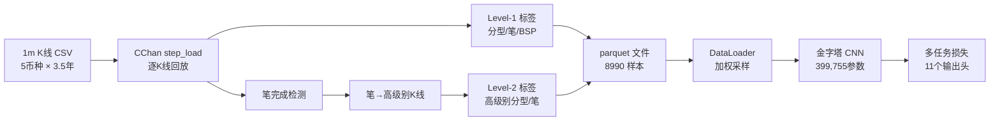
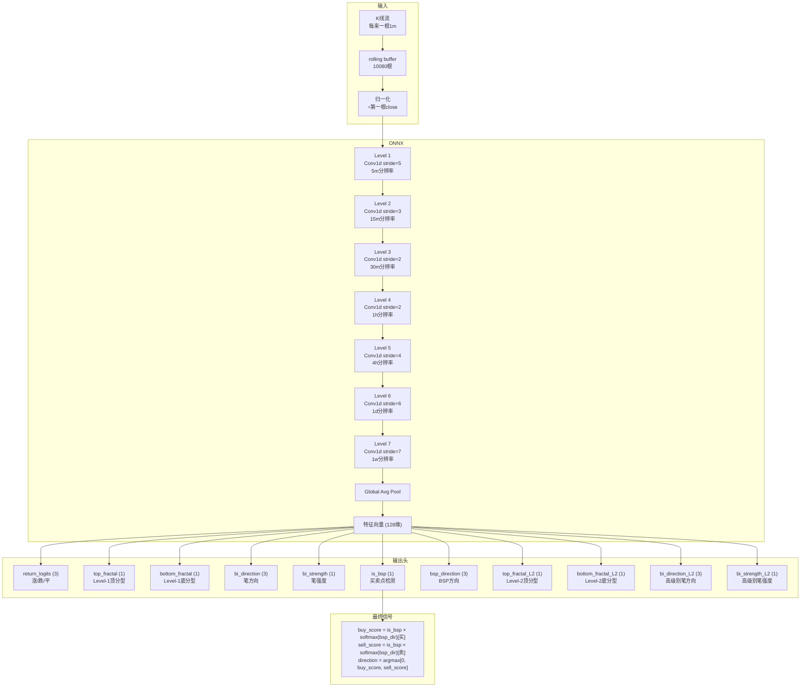
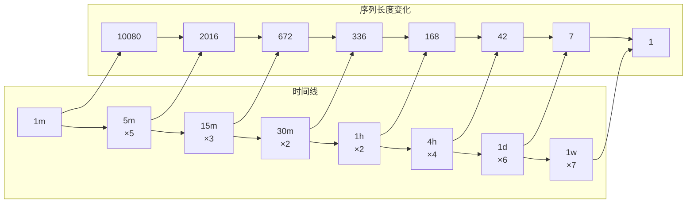
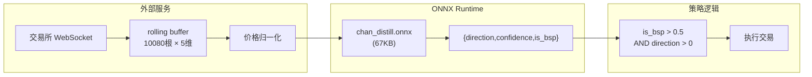

# Chan-Distill 模型架构

## 数据流（训练）

```mermaid
flowchart LR
    A["1m K线 CSV<br/>5币种 × 3.5年"] --> B["CChan step_load<br/>逐K线回放"]
    B --> C["Level-1 标签<br/>分型/笔/BSP"]
    B --> D["笔完成检测"]
    D --> E["笔→高级别K线"]
    E --> F["Level-2 标签<br/>高级别分型/笔"]
    C --> G["parquet 文件<br/>8990 样本"]
    F --> G
    G --> H["DataLoader<br/>加权采样"]
    H --> I["金字塔 CNN<br/>399,755参数"]
    I --> J["多任务损失<br/>11个输出头"]
```

## 模型推理

```mermaid
flowchart TD
    subgraph 输入
        K1["K线流<br/>每来一根1m"] --> BUF["rolling buffer<br/>10080根"]
        BUF --> NORM["归一化<br/>÷第一根close"]
    end

    subgraph ONNX
        NORM --> L1["Level 1<br/>Conv1d stride=5<br/>5m分辨率"]
        L1 --> L2["Level 2<br/>Conv1d stride=3<br/>15m分辨率"]
        L2 --> L3["Level 3<br/>Conv1d stride=2<br/>30m分辨率"]
        L3 --> L4["Level 4<br/>Conv1d stride=2<br/>1h分辨率"]
        L4 --> L5["Level 5<br/>Conv1d stride=4<br/>4h分辨率"]
        L5 --> L6["Level 6<br/>Conv1d stride=6<br/>1d分辨率"]
        L6 --> L7["Level 7<br/>Conv1d stride=7<br/>1w分辨率"]
        L7 --> GAP["Global Avg Pool"]
        GAP --> VEC["特征向量 (128维)"]
    end

    subgraph 输出头
        VEC --> R["return_logits (3)<br/>涨/跌/平"]
        VEC --> T1["top_fractal (1)<br/>Level-1顶分型"]
        VEC --> B1["bottom_fractal (1)<br/>Level-1底分型"]
        VEC --> BD["bi_direction (3)<br/>笔方向"]
        VEC --> BS["bi_strength (1)<br/>笔强度"]
        VEC --> BSP["is_bsp (1)<br/>买卖点检测"]
        VEC --> BSPD["bsp_direction (3)<br/>BSP方向"]
        VEC --> T2["top_fractal_L2 (1)<br/>Level-2顶分型"]
        VEC --> B2["bottom_fractal_L2 (1)<br/>Level-2底分型"]
        VEC --> BD2["bi_direction_L2 (3)<br/>高级别笔方向"]
        VEC --> BS2["bi_strength_L2 (1)<br/>高级别笔强度"]
    end

    subgraph 最终信号
        BSP --> SIG["buy_score = is_bsp × softmax(bsp_dir)[买]<br/>sell_score = is_bsp × softmax(bsp_dir)[卖]<br/>direction = argmax[0, buy_score, sell_score]"]
    end
```

## 金字塔降采样过程

```mermaid
flowchart LR
    subgraph 时间线
        direction LR
        M1["1m"] --> M5["5m<br/>×5"]
        M5 --> M15["15m<br/>×3"]
        M15 --> M30["30m<br/>×2"]
        M30 --> H1["1h<br/>×2"]
        H1 --> H4["4h<br/>×4"]
        H4 --> D1["1d<br/>×6"]
        D1 --> W1["1w<br/>×7"]
    end

    subgraph 序列长度变化
        direction LR
        N10080["10080"] --> N2016["2016"]
        N2016 --> N672["672"]
        N672 --> N336["336"]
        N336 --> N168["168"]
        N168 --> N42["42"]
        N42 --> N7["7"]
        N7 --> N1["1"]
    end

    M1 --> N10080
    M5 --> N2016
    M15 --> N672
    M30 --> N336
    H1 --> N168
    H4 --> N42
    D1 --> N7
    W1 --> N1
```

## 部署架构

```mermaid
flowchart LR
    subgraph 外部服务
        EX["交易所 WebSocket"] --> BUF["rolling buffer<br/>10080根 × 5维"]
        BUF --> NORM["价格归一化"]
    end

    subgraph ONNX Runtime
        NORM --> INF["chan_distill.onnx<br/>(67KB)"]
        INF --> OUT["{direction,confidence,is_bsp}"]
    end

    subgraph 策略逻辑
        OUT --> FILTER["is_bsp > 0.5<br/>AND direction > 0"]
        FILTER --> TRADE["执行交易"]
    end
```
